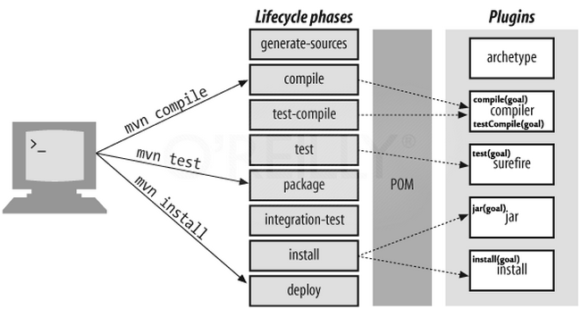

# Gerenciamento de Dependências e Build em Java com Maven

`mvn org.apache.maven.plugins:maven-archetype-plugin:3.1.2:generate -DarchetypeArtifactId="maven-archetype-quickstart" -DarchetypeGroupId="org.apache.maven.archetypes" -DarchetypeVersion="1.4" -DgroupId="com.example" -DartifactId="mavedemo"`

- `mvn`: Comando para executar tarefas em projetos Maven;
- `org.apache.maven.plugins:maven-archetype-plugin:3.1.2:generate`: Especifica o plugin que será executado, sua versão e seu objetivo;
  - `generate` cria um projeto com base em um arquétipo (modelo).
- `-DarchetypeArtifactId="maven-archetype-quickstart"`: Define o arquétipo a ser usado.
  - `quickstart` corresponde a um modelo básico.
- `-DarchetypeVersion="1.4"`: Versão do arquétipo;
- `-DgroupId="com.example"`: Definição do ID do grupo para o projeto, geralmente baseado no domínio reverso da organização;
- `-DartifactId="mavedemo"`: Define o ID do artefato, o nome do projeto;

## Comandos Úteis

- `mvn compile`: Realiza a compilação dos códigos Java. Gera a pasta target.
- `nvm test`: Busca todas as classes de testes e execute suas validações.
- `mvn package`: Cria o JAR da aplicação.
- `mvn clean`: Limpa o diretório de trabalho (pasta target).

## POM

- Project Object Model;
- Unidade fundamental de trabalho;
- Formato XML;
- Detalha o projeto e como o construir;
- Procura pelo `pom.xml` para realizar sua execução;
  - Nome do projeto, dependências, módulos, configurações de build, configurações de ambiente, detalhes do projeto.

`pom.xml` básico:

```xml
<project>
  <modelVersion>...</modelVersion>
  <groupId>...</groupId>
  <artifactId>...</artifactId>
  <version>...</version>
</project>
```

Outras configurações não especificadas serão adotadas do Super POM do maven.

## Repositórios

- Locais de onde se obtem plugins e bibliotecas que o Maven provê;
- Local e Remoto;
- Configuração global: via `<maven>/conf/settings.xml`;
- Repositório Local: repositório na máquina utilizado pelo Maven para buscar os aterfatos em uma estratégia de caching;
  - Localizado em `<user/home>/.m2/repository`;
- `mvn compile` busca uma dependência no repositório local, e em caso de falha, busca a referência do repositório remoto para realizar download no repositório local.

## Dependências

Para adicionar uma dependência, dentro de `<dependencies></dependencies>`:

```xml
<dependency>
  <groupId>[id da organização com as regras de nomes de pacote Java]</groupId>
  <artifcat>[nome do projeto]</artifactId>
  <version>[número da versão]<version>
</dependency>
```

- Dependências diretas: declaradas no pom.xml;
- Dependências transitivas: dependências obrigatórias das dependências delcaradas no `pom.xml`;
  - Para limitar a quantidade de dependências transitivas trazidas de um repositório, o Maven permite a especificação de **escopo** na declaração das dependências

Escopo na declaração de dependências:

- **compile** (transitivo): Default, disponível em todos os classpaths.
- **runtime**: Dependência necessária para execução e não para compilação. Maven inclui no classpath dos escopos de runtime e test
- **test**: Disponível apenas para compilação e execução de testes
- **provided**: A dependência será fornecida em tempo de dexecução por uma implmentação JDK ou via container. São adicionado no classpath usado para compile e test, mas não runtime.
- **system**: Similar ao provided, exceto por ser necessário prover o JAR explicitamente. A dependência com esse escopo é adicionada no classpath usado para compile e test, mas não em runtime.

## Maven Build Lifecycle


- Composto por 3 ciclos de vida
  - Cada ciclo possui fases (Maven Phases)
  - Cada fase possui objetivos (Maven Goals)

### Default Lifecycle



- Principal ciclo;
- Deploy local;
- 23 fases (comandos), sendo as principais:
  - `validate`:
  - `compile`:
  - `test-compile`:
  - `test`:
  - `integration-test`:
  - `package`:
  - `install`:
  - `deploy`:

### Clean Lifecycle

- Ciclo de limpeza do projeto;
  - `pre-clean`
  - `clean`
  - `post-clean`

### Site Lifecycle

- Página web e documentação;
  - `pre-site`
  - `site`
  - `post-site`
  - `site-deploy`

## Plugins

- Fornecem a maiorida das funcionalidades;
- Estilo arquitetural para extensibilidade (criação de um plugin próprio);
- Escrito prioritariamente em Java e disponibilizados comumente como JARs;
- `mvn [plugin-name]:[goal-name]`;
